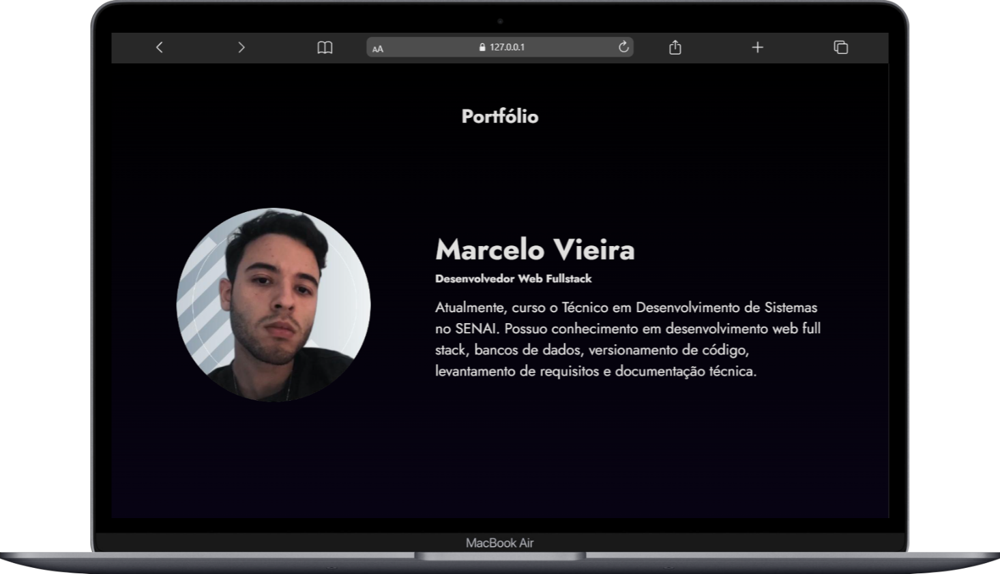

# Portfólio

O principal objetivo é criar um site estático responsivo que sirva como vitrine do meu trabalho.
A proposta é apresentar meus projetos de forma simples e intuitiva, reforçando minha presença profissional e demonstrando minha capacidade técnica.

## Tecnologias
* HTML
* CSS

## Autor
[Marcelo Vieira](<https://www.linkedin.com/in/marcelovieirasilva/>)
